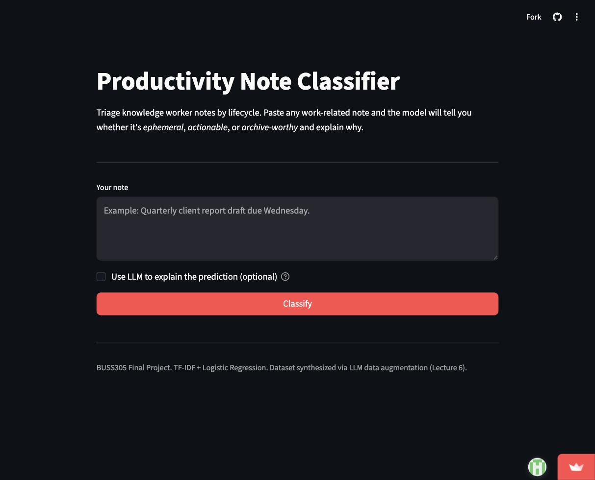
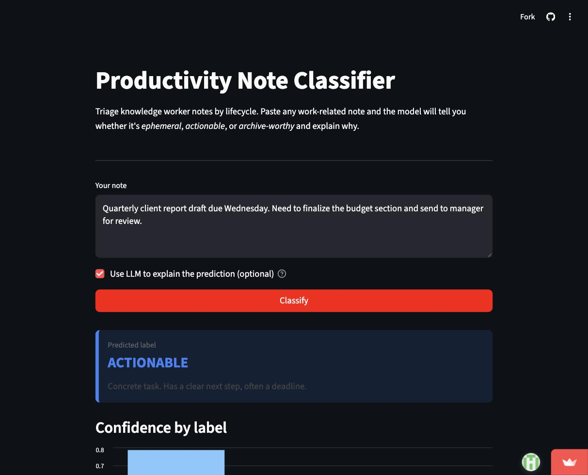

# AIFB Final Project — Productivity Note Classifier

> **Live demo:** [aifb-classifier.streamlit.app](https://aifb-classifier.streamlit.app)
>
> 
>
> | | |
> |---|---|
> |  |  |

> **Should I keep this note?** A classifier that tags personal notes as
> *ephemeral*, *actionable*, or *archive-worthy*, with an optional LLM
> explanation layer.

**Course:** BUSS305 — Artificial Intelligence for Business
**Author:** Obi
**Submission:** Final Project (Build and Deploy Your Own AI System)

---

## What this is

Knowledge workers write hundreds of notes a week. Most of them lose their
value within hours. A few become tasks. A small handful are insights worth
keeping for years. The problem is telling them apart at the moment they're
written.

This project trains a supervised classifier that triages a note into one of
three lifecycle buckets, and serves it through a web interface anyone can use
in a browser.

| Label          | Meaning                                                  |
| -------------- | -------------------------------------------------------- |
| `ephemeral`    | Short-lived reminder, safe to discard within hours/days. |
| `actionable`   | Concrete task with a next step.                          |
| `archive`      | Insight, lesson, or decision worth preserving.           |

---

## How it maps to the course

| Lecture                                | How it appears here                                                              |
| -------------------------------------- | -------------------------------------------------------------------------------- |
| 3 — Data preprocessing                 | TF-IDF normalization, train/test split, deduplication.                           |
| 4 — Methods                            | Logistic Regression with n-grams for text quantification.                        |
| 5 — Vibe coding                        | Streamlit frontend, LLM-assisted development workflow.                           |
| 6 — LLM data augmentation              | The training set itself is **synthesized by an LLM** with label-conditioned prompting, controllable attributes (voice, domain), and post-hoc deduplication. |

---

## Repository layout

```
AIFB/
├── data/
│   ├── generate_dataset.py     # LLM-driven dataset synthesis
│   └── notes.csv               # generated dataset (not committed)
├── models/
│   ├── classifier.pkl          # trained pipeline
│   ├── metrics.json            # evaluation results
│   └── confusion.png           # confusion matrix figure
├── src/
│   ├── train.py                # train + evaluate the classifier
│   └── llm_explain.py          # optional LLM explanation layer
├── app.py                      # Streamlit web app
├── requirements.txt
├── .env.example
└── README.md
```

---

## How to run it locally

1. Clone and install:
   ```bash
   git clone <repo-url>
   cd AIFB
   python -m venv .venv && source .venv/bin/activate
   pip install -r requirements.txt
   ```

2. Set your API key:
   ```bash
   cp .env.example .env
   # edit .env and paste your ANTHROPIC_API_KEY
   ```

3. Generate the dataset (one-time, takes a few minutes):
   ```bash
   python data/generate_dataset.py
   ```

4. Train the model:
   ```bash
   python src/train.py
   ```

5. Launch the app:
   ```bash
   streamlit run app.py
   ```

The app will open at `http://localhost:8501`.

---

## Live demo

Deployed via **Streamlit Community Cloud** at:
`https://<app-url>.streamlit.app`

---

## Design decisions

**Why synthesized data?**
Building a clean labeled corpus of personal notes from real users is a
months-long effort and raises privacy concerns. Lecture 6 demonstrated that
LLM-driven augmentation can produce label-consistent training data when paired
with the right guardrails. The synthesis script uses three: label-conditioned
prompting, deliberate diversity along voice and domain axes, and post-hoc
deduplication.

**Why Logistic Regression over deep models?**
Per the course's emphasis on Occam's Razor and the small dataset size
(~2,000 examples), a linear classifier with TF-IDF features is the right tool.
It trains in seconds, is interpretable, and avoids overfitting risks that
neural models would introduce at this scale.

**Why an LLM explanation layer?**
The classifier is the source of truth. The LLM is constrained to interpret
its decision in natural language. This separation matches the lecture's
guidance: prediction should come from a trained model, not from raw LLM
output.

---

## Limitations and future work

- The dataset is synthetic. Performance on real-world notes from a single
  user will require fine-tuning on a personal corpus.
- Three labels is a coarse abstraction. Real memory systems benefit from
  finer-grained tags (project, person, deadline, status).
- The current classifier treats each note in isolation. A useful next step
  is sequence-aware classification that considers prior notes as context.

This project is a foundational component for a larger system I am building
called **Modun** — a memory-first agent operating system. The same lifecycle
question (what should be kept, what should be promoted to long-term memory)
operates at the heart of Modun's architecture.
